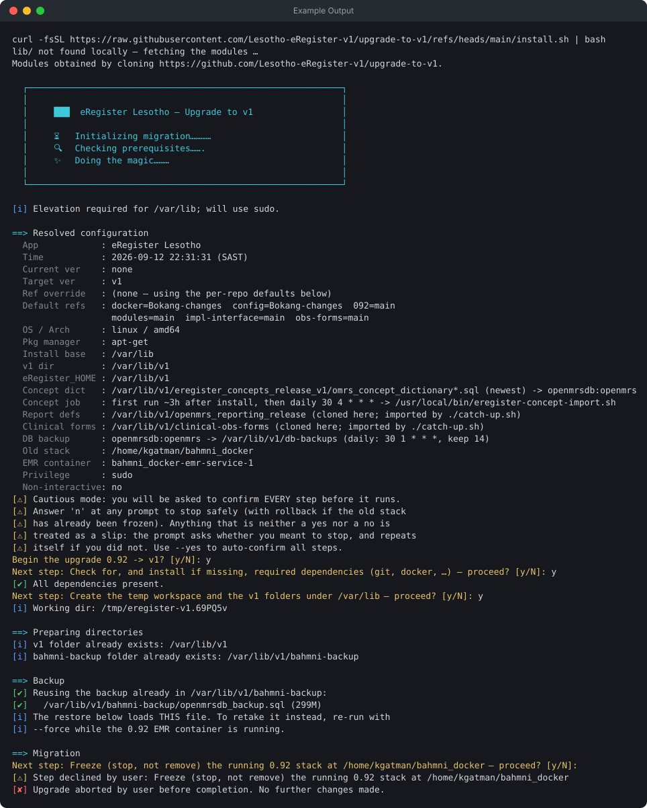

# Example output — upgrade to v1

Terminal output from running `install.sh` on a host with an existing 0.92 backup,
in the colors the scripts print. Expand **Plain text** below the image to copy from it.

## Example Output



<details>
<summary>Plain text</summary>

```text
curl -fsSL https://raw.githubusercontent.com/Lesotho-eRegister-v1/upgrade-to-v1/refs/heads/main/install.sh | bash
lib/ not found locally — fetching the modules …
Modules obtained by cloning https://github.com/Lesotho-eRegister-v1/upgrade-to-v1.

  ┌────────────────────────────────────────────────────────────┐
  │                                                            │
  │     ███  eRegister Lesotho — Upgrade to v1                 │
  │                                                            │
  │     ⏳  Initializing migration…………                         │
  │     🔍  Checking prerequisites…….                          │
  │     ✨  Doing the magic………                                 │
  │                                                            │
  └────────────────────────────────────────────────────────────┘

[ℹ] Elevation required for /var/lib; will use sudo.

==> Resolved configuration
  App            : eRegister Lesotho
  Time           : 2026-09-12 22:31:31 (SAST)
  Current ver    : none
  Target ver     : v1
  Ref override   : (none — using the per-repo defaults below)
  Default refs   : docker=Bokang-changes  config=Bokang-changes  092=main
                   modules=main  impl-interface=main  obs-forms=main
  OS / Arch      : linux / amd64
  Pkg manager    : apt-get
  Install base   : /var/lib
  v1 dir         : /var/lib/v1
  eRegister_HOME : /var/lib/v1
  Concept dict   : /var/lib/v1/eregister_concepts_release_v1/omrs_concept_dictionary*.sql (newest) -> openmrsdb:openmrs
  Concept job    : first run ~3h after install, then daily 30 4 * * * -> /usr/local/bin/eregister-concept-import.sh
  Report defs    : /var/lib/v1/openmrs_reporting_release (cloned here; imported by ./catch-up.sh)
  Clinical forms : /var/lib/v1/clinical-obs-forms (cloned here; imported by ./catch-up.sh)
  DB backup      : openmrsdb:openmrs -> /var/lib/v1/db-backups (daily: 30 1 * * *, keep 14)
  Old stack      : /home/kgatman/bahmni_docker
  EMR container  : bahmni_docker-emr-service-1
  Privilege      : sudo
  Non-interactive: no
[⚠] Cautious mode: you will be asked to confirm EVERY step before it runs.
[⚠] Answer 'n' at any prompt to stop safely (with rollback if the old stack
[⚠] has already been frozen). Anything that is neither a yes nor a no is
[⚠] treated as a slip: the prompt asks whether you meant to stop, and repeats
[⚠] itself if you did not. Use --yes to auto-confirm all steps.
Begin the upgrade 0.92 -> v1? [y/N]: y
Next step: Check for, and install if missing, required dependencies (git, docker, …) — proceed? [y/N]: y
[✔] All dependencies present.
Next step: Create the temp workspace and the v1 folders under /var/lib — proceed? [y/N]: y
[ℹ] Working dir: /tmp/eregister-v1.69PQ5v

==> Preparing directories
[ℹ] v1 folder already exists: /var/lib/v1
[ℹ] bahmni-backup folder already exists: /var/lib/v1/bahmni-backup

==> Backup
[✔] Reusing the backup already in /var/lib/v1/bahmni-backup:
[✔]   /var/lib/v1/bahmni-backup/openmrsdb_backup.sql (299M)
[ℹ] The restore below loads THIS file. To retake it instead, re-run with
[ℹ] --force while the 0.92 EMR container is running.

==> Migration
Next step: Freeze (stop, not remove) the running 0.92 stack at /home/kgatman/bahmni_docker — proceed? [y/N]:
[⚠] Step declined by user: Freeze (stop, not remove) the running 0.92 stack at /home/kgatman/bahmni_docker
[✘] Upgrade aborted by user before completion. No further changes made.
```

</details>
